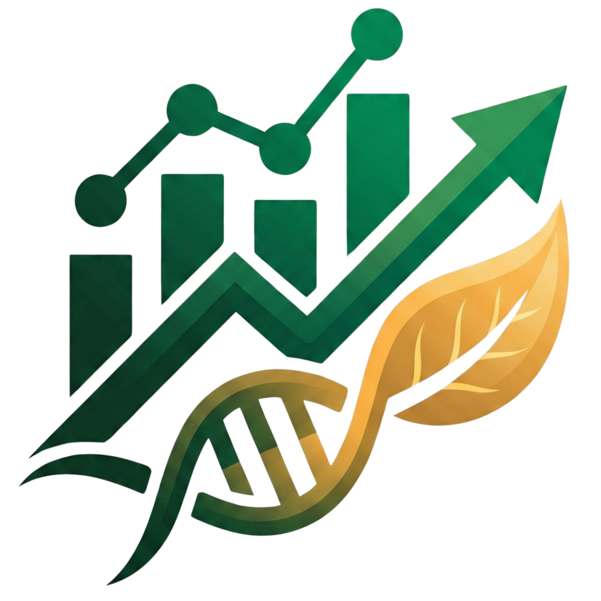

  

# 🌌 LifeData Analytics Hub

> **Premium Global Insights Dashboard** for Lifewood's international crowdsourcing and BYU projects.

---

## ✨ Design Philosophy: The "Aurora" Experience
LifeData is not just a dashboard; it's a high-performance visual experience. The interface utilizes a **Modern Glassmorphism** design system paired with an interactive **Aurora background mesh**, providing a premium SaaS feel that feels alive and responsive.

### 🎨 Visual Highlights:
- **Aurora Mesh Backdrop**: Smoothly animated color gradients that create depth.
- **Frosted Glass Components**: High-end transparency effects with subtle borders.
- **Micro-Animations**: Staggered entrance animations and hover-glow effects on all interactive elements.
- **Responsive Layout**: Seamless transition between desktop analytics and mobile monitoring.

---

## 🚀 Core Functionalities

### 📊 Dynamic Project Dashboards
Integrated real-time data from multiple international project tables (Philippines, Kenya, Malawi, DRC, Ghana, etc.).
- **Automated Metrics**: Instant calculation of Total Participants, Average Age, and Nationalities.
- **Organizational Insights**: Automatic identification of top affiliations and partner groups.
- **Trend Analysis**: Monthly join-rate visualizations to track project growth.

### 🔍 Advanced Data Management
- **Universal Search**: Lightning-fast filtering across all participant fields.
- **Smart Normalization**: Automatically merges variations (e.g., "Student Number" vs "Student ID") for accurate statistics.
- **Demographic Distribution**: Interactive charts for Gender and Age breakdown.

### 🛡️ Administrative Security
- **Anonymized Profiles**: Generic Admin accounts for security and privacy.
- **Supabase Integration**: Secure, scalable backend for real-time data retrieval.

---

## 🛠️ Tech Stack
- **Frontend**: React 18, Vite
- **Styling**: Tailwind CSS + Custom Vanilla CSS (Design Tokens)
- **Database**: Supabase (Postgres)
- **Icons**: Lucide React
- **Charts**: Recharts (Custom themed)
- **Animations**: CSS Keyframes + Staggered Delays

---

## 🌐 Live Access
Check out the production environment:  
**[phlifewood-lifedata.vercel.app](https://phlifewood-lifedata.vercel.app/)**

---

© 2026 Lifewood PH. All rights reserved. Powered by the Advanced Agentic Coding Team.
